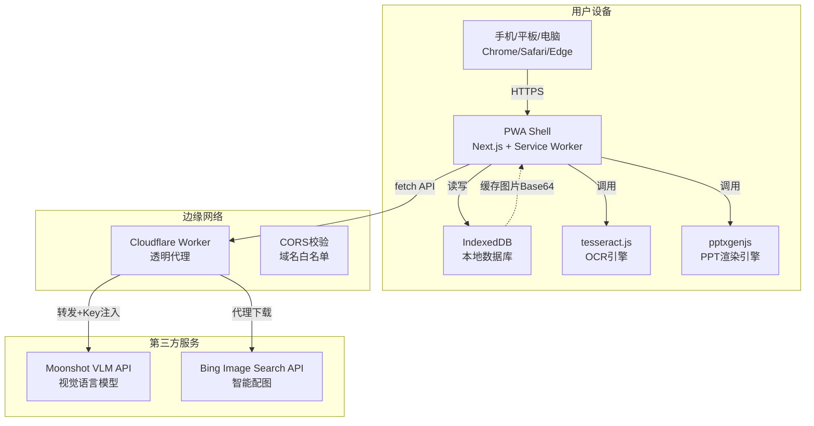
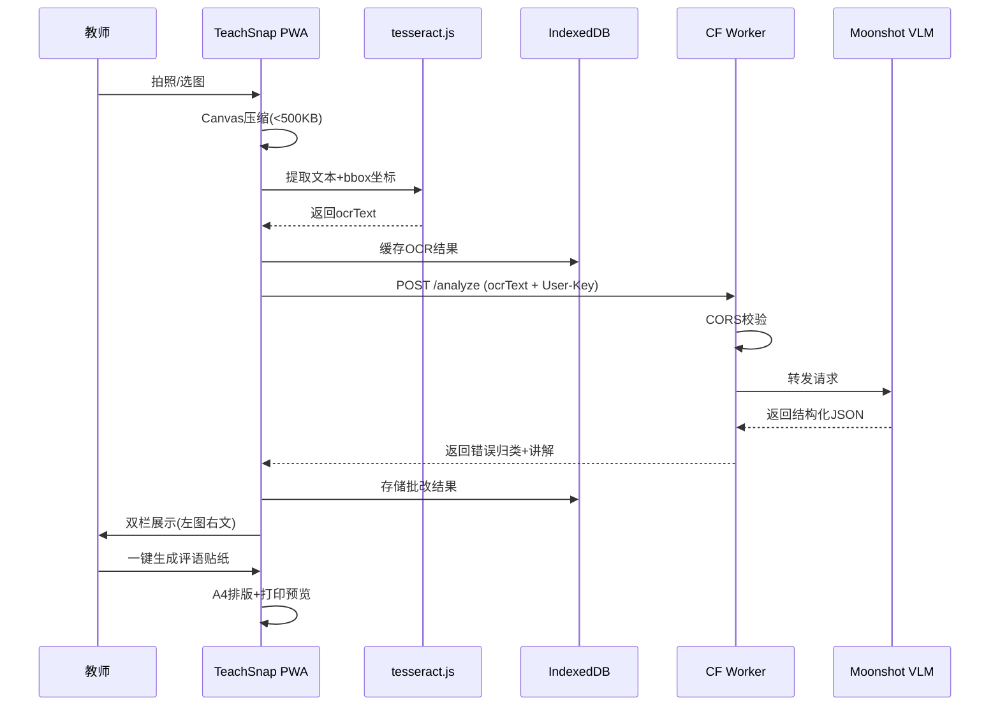
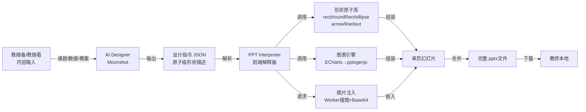
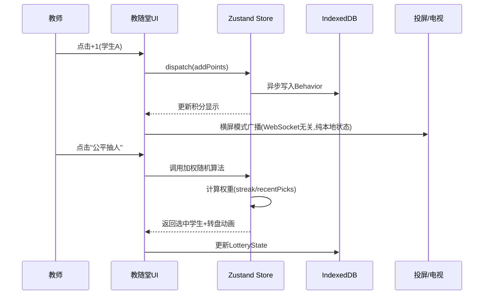

**TeachSnap 教随拍 —— 产品需求文档 (PRD) v2.0**

---

## 1. 文档信息

| 项目 | 内容 |
|------|------|
| 产品名称 | TeachSnap 教随拍 |
| 定位 | 乡村教师的离线 AI 工作台 |
| 参赛赛道 | TRAE × 脉脉「Hello AI 科技向善」— 命题二「为乡村教师打造得力教学助手」 |
| 目标平台 | PWA（渐进式网页应用），支持手机 / 平板 / 桌面浏览器 |
| 核心栈 | Next.js 14 + TypeScript + IndexedDB + Cloudflare Workers + Moonshot VLM + pptxgenjs |
| 文档版本 | v2.0 |
| 日期 | 2026-04-21 |

---

## 2. 产品概述

### 2.1 背景
乡村教师普遍面临**大班额**（50-60 人/班）、**网络不稳定**、**硬件老旧**、**备课时间被严重挤压**的困境。市面上主流教育 SaaS（希沃、班级优化大师等）依赖在线服务、收费昂贵、功能臃肿，在乡村场景下**打不开、用不起、学不会**。

### 2.2 产品定义
TeachSnap 教随拍是一款**离线优先的 PWA 应用**，通过「拍照即批改、数据即备课、积分即管理、AI 即设计」的理念，将作业批改、教案生成、智能组卷、课堂管理、学情分析、家校沟通、课件演示七大环节整合为**一个闭环**。所有学生数据 100% 本地存储，AI 能力采用 BYOK（Bring Your Own Key）模式，确保隐私零泄露、成本可控。

### 2.3 核心价值主张
> **拍一次作业，自动完成批改、归档、分层补救、学情统计、家长通知与课件生成。零服务器存储学生数据，弱网环境下全功能可用。**

---

## 3. 目标用户与用户画像

### 3.1 主要用户：乡村一线教师
- **身份**：乡镇中心小学/初中教师，常兼任班主任与多学科教学
- **设备**：3-5 年前 Android 手机（主要）、学校公用 Win7 电脑（次要）
- **网络**：教室 4G 信号弱，办公室有 WiFi 但常断流
- **痛点排序**：
  1. 作业批改占用晚间 2-3 小时，机械重复
  2. 备课缺乏针对性（不知道学生哪里错了，只能按教材顺序讲）
  3. 课堂互动困难（大班额，抽人总叫那几个，小组合作难组织）
  4. 家校沟通耗时（每周手写学生表现，复制粘贴到微信群）
  5. 课件制作难（找模板、排版、配图耗费大量时间）

### 3.2 次要用户：学生与家长
- **学生**：通过评语贴纸上的二维码，扫码查看讲解（语音/文字）
- **家长**：每周收到自动生成的「学生表现简报」，了解学习情况

---

## 4. 功能架构（All-in-One）

产品由 **7 个功能视图** 组成，共享同一套本地数据库与配置系统。

```
┌─────────────────────────────────────────────────────┐
│              TeachSnap PWA (Next.js)                │
│                                                     │
│  ┌─────────┐ ┌─────────┐ ┌─────────┐ ┌─────────┐  │
│  │ 教随拍  │ │ 教随备  │ │ 教随测  │ │ 教随演  │  │
│  │ 作业批改│ │ 智能备课│ │ 智能组卷│ │ AI 课件 │  │
│  └─────────┘ └─────────┘ └─────────┘ └─────────┘  │
│  ┌─────────┐ ┌─────────┐ ┌─────────┐              │
│  │ 教随堂  │ │ 教随看  │ │ 教随联  │              │
│  │ 课堂管理│ │ 学情数据│ │ 家校通知│              │
│  └─────────┘ └─────────┘ └─────────┘              │
│                                                     │
│  共享基础设施：                                      │
│  • BYOK 配置 (Moonshot API Key)                     │
│  • 班级学生库 + 本地数据库 (IndexedDB)               │
│  • A4 打印引擎 + 离线缓存 (Service Worker)          │
└─────────────────────────────────────────────────────┘
           │
[Cloudflare Worker] ────→ [Moonshot VLM API]
(透明代理，零数据落盘)     [Bing Image Search API]
```

---

## 5. 详细功能需求

### 5.1 教随拍 —— 作业批改

**目标**：将 50 份作业批改时间从 2 小时压缩至 20 分钟。

#### 5.1.1 拍照与预处理
- **FR-001**：支持调用设备摄像头拍照，或从相册选择图片。
- **FR-002**：前端 Canvas 自动压缩图片至 <500KB（JPEG，质量 0.7），弱网环境下 3 秒内完成上传准备。
- **FR-003**：支持**批量模式**：连续拍摄多页作业，生成待处理队列。

#### 5.1.2 OCR 文本提取
- **FR-004**：前端本地运行 tesseract.js（chi_sim+eng 训练集），提取作业文本与每行大致纵向坐标（`bbox.y0`）。
- **FR-005**：OCR 结果本地缓存，支持在无网络时查看已识别的文本。

#### 5.1.3 VLM 智能分析
- **FR-006**：将 OCR 文本与用户 Key 一并发送至 Cloudflare Worker，转发至 Moonshot VLM（`moonshot-v1-8k-vision-preview`）。
- **FR-007**：VLM 返回结构化 JSON：
  ```json
  {
    "questions": [
      {
        "number": 3,
        "studentAnswer": "13+28=31",
        "isCorrect": false,
        "errorType": "进位错误",
        "confidence": 0.92,
        "suggestion": "个位满十未向十位进1，建议草稿纸标出进位数字",
        "remedy": ["15+27=?", "38+24=?"]
      }
    ]
  }
  ```
- **FR-008**：置信度低于 0.7 的结果标记「需人工复核」，教师可一键修正。

#### 5.1.4 双栏批改界面
- **FR-009**：左侧显示原图（可缩放、拖拽），右侧显示 OCR 文本与 AI 批注。
- **FR-010**：点击右侧「第 X 题错误」，左侧原图自动滚动至对应纵向区域（基于 OCR 坐标映射）。
- **FR-011**：三色标记规范：
  - 🔴 红色：错误点
  - 🟡 黄色：改进建议
  - 🟢 绿色：优秀处

#### 5.1.5 输出物（可打印）
- **FR-012**：**评语贴纸页**：A4 排版，8 小张/页。每张含：错误类型图标 + 15 字以内诊断 + 二维码（链接语音讲解）。
- **FR-013**：**班级批改总表**：50 人 × 题号矩阵，一眼定位全班高频错误。
- **FR-014**：**个人错题条**：单学生汇总，可贴作业本。

### 5.2 教随备 —— 智能备课

**目标**：基于真实错题数据，10 分钟生成可直接使用的补救教案。

#### 5.2.1 数据驱动备课
- **FR-015**：自动读取教随拍近 7 天数据，识别高频错误知识点，主动提示「本周分数除法错误率 42%，是否生成专项教案？」
- **FR-016**：支持手动输入：学科、年级、课题、学生基础（薄弱/普通/较好）、硬件条件（有投影/仅黑板）。

#### 5.2.2 教案生成
- **FR-017**：调用 Moonshot 生成结构化教案 JSON，包含：
  - 导入环节（3min，逐字稿 + 板书设计）
  - 精讲环节（针对高频错误点，附话术与互动设计）
  - 分层练习（A/B/C 三组，自动关联教随测题库）
  - 小结与作业布置
- **FR-018**：教案支持导出 Markdown（编辑）或 PDF（直接打印）。

#### 5.2.3 本地模板缓存
- **FR-019**：常用教案模板缓存至 IndexedDB，无网络时仍可基于模板手动填充。

### 5.3 教随测 —— 智能组卷

**目标**：勾选知识点，30 秒生成可直接打印的 A4 试卷。

#### 5.3.1 题库与抽题
- **FR-020**：内置本地题库（JSON，预置 500+ 题，按学科/知识点/难度/题型标签）。
- **FR-021**：教师勾选：知识点（多选）、难度分布（基础 60%/中等 30%/提高 10%）、题型（选择/填空/计算/应用）。
- **FR-022**：OI 级抽题算法：
  1. 筛选候选集（知识点匹配）
  2. 贪心去重：优先抽取近 3 次测验未出现的题目
  3. 随机扰动：同标签下随机选具体题，避免各班雷同
  4. 难度加权：按设定比例分配

#### 5.3.2 卷面排版
- **FR-023**：A4 标准卷面自动生成：密封线、得分栏、页眉页脚、答题空白（按题目长度动态计算，防止跨页截断）。
- **FR-024**：附带答案页（教师用，可单独打印）。
- **FR-025**：输出图片版（PNG，300dpi，兼容老旧打印机）。

### 5.4 教随堂 —— 课堂管理

**目标**：替代「班级优化大师」核心功能，零硬件成本激活课堂。

#### 5.4.1 积分银行
- **FR-026**：大按钮设计（+1 / -1 / 自定义），支持单点、批量（全组/全班）操作。
- **FR-027**：积分类型预设：作业全对、主动回答、帮助同学、未带课本、纪律扣分等，支持自定义。
- **FR-028**：**作业联动**：教随拍批改完成后，一键映射积分（全对 +3、良好 +1、需订正 0、未交 -2）。

#### 5.4.2 公平抽人
- **FR-029**：加权随机算法：
  - 基础权重 = 1
  - 连续未被抽中，每天 +0.5（保底机制）
  - 近 3 天被抽 2 次以上，权重 -0.3（防重复）
  - 加权随机抽取，前端转盘动画
- **FR-030**：支持按条件抽人：「抽一个本周积分最低的」「抽一个数学错误率高的」。

#### 5.4.3 小组 PK
- **FR-031**：自动分组：按座位顺序、学号、或积分均衡（强弱搭配）拆成 4 人小组。
- **FR-032**：组内积分实时汇总，课堂大屏展示排名（横屏模式字体放大 200%）。
- **FR-033**：支持「挑组」功能：随机抽一组上台板演，其他组打分。

#### 5.4.4 课堂工具箱
- **FR-034**：倒计时器（控制环节时间，可预设常用时长）。
- **FR-035**：噪音监测：调用麦克风 API，分贝过高时手机震动提醒。

#### 5.4.5 每周战报
- **FR-036**：自动汇总本周积分变化，生成「本周之星」海报图（HTML → Canvas → PNG）。
- **FR-037**：支持截图分享至微信/钉钉/朋友圈。

### 5.5 教随看 —— 学情数据

**目标**：零额外操作，自动聚合所有模块数据，生成可行动的洞察。

#### 5.5.1 班级仪表盘
- **FR-038**：**热力图**：知识点 × 时间（近 4 周），颜色深浅表示错误率趋势。
- **FR-039**：**高频错误榜**：本周 TOP 5 错误类型，点击直达「生成专项教案」。
- **FR-040**：**临界生预警**：连续 3 次同类型错误，或成绩波动 >20 分，自动标红。

#### 5.5.2 个人错题本
- **FR-041**：选择学生 + 时间范围，导出 PDF 错题本（含原题、错误答案、正确解析、同类推荐题）。
- **FR-042**：错题本支持二维码链接，学生扫码查看讲解。

#### 5.5.3 交叉分析
- **FR-043**：「学习态度-能力」四象限图：横轴（课堂积分）、纵轴（作业正确率），自动划分学霸区、努力区、潜力区、关注区。

### 5.6 教随联 —— 家校通知

**目标**：一键生成人话，替代教师手写/复制粘贴。

#### 5.6.1 周报自动生成
- **FR-044**：每周五自动汇总：班级平均分、高频错误、本周之星名单。
- **FR-045**：生成「班级简报」文案，一键复制到微信群/钉钉群。

#### 5.6.2 个人通知
- **FR-046**：选择学生，生成「本周表现」文案（温和版/直接版两种语气）。
- **FR-047**：文案自动附加：课堂积分变化、作业错误类型、在家辅导建议。

#### 5.6.3 海报生成
- **FR-048**：将战报/通知转为图片（防微信折叠），支持自定义背景色与学校 Logo 占位。

### 5.7 教随演 —— AI 课件（核心创新）

**目标**：教案/数据一键转为可下载的 `.pptx` 课件，AI 从零自主设计每一页的布局、形状、配色与配图。

#### 5.7.1 AI PPT DSL 设计指令
- **FR-049**：Moonshot 不返回模板标签，而是返回**原子级设计指令 JSON**，精确到每个形状的类型、坐标、尺寸、颜色、文本样式。
- **FR-050**：设计指令 Schema 包含：
  - `background`: 页面背景色
  - `shapes[]`: 形状列表（`rect` / `roundRect` / `ellipse` / `arrow` / `line` / `text`），含 `x, y, w, h, fill, text, fontSize, color, bold`
  - `images[]`: 图片区域，含 `keyword, x, y, w, h, border`
- **FR-051**：AI 自主决策逻辑：
  - 数据强调 → 椭圆/圆角矩形包裹大数字
  - 流程讲解 → 箭头连接步骤
  - 对比分析 → 左右分栏或上下分层
  - 时间趋势 → 折线节点
  - 无预设版式，每页布局根据内容量自适应

#### 5.7.2 前端 PPT 解释器
- **FR-052**：解释器解析设计指令 JSON，逐形状调用 `pptxgenjs` API 绘制，非模板填充。
- **FR-053**：支持形状叠加文本（如椭圆内嵌数字、圆角矩形内嵌标题）。
- **FR-054**：约束：单页最多 8 个形状，最多 2 张图片，确保渲染性能与可读性。

#### 5.7.3 联网智能配图
- **FR-055**：Worker 代理调用 Bing Image Search API（免费层 1000 次/月），根据 AI 指定的 `keyword` 搜索图片。
- **FR-056**：Worker 下载图片并转为 Base64，嵌入 PPT（不依赖外链，离线可打开）。
- **FR-057**：已搜索图片缓存至 IndexedDB，同关键词二次生成秒级响应。

#### 5.7.4 数据联动图表
- **FR-058**：教随看/教随堂数据自动流入，AI 根据数据特征自主决策图表形式：
  - 多知识点对比 → 横向条形图（形状组合模拟）
  - 单数据强调 → 大数字 + 椭圆
  - 时间趋势 → 折线 + 节点圆点
- **FR-059**：图表数据直接来自 IndexedDB，非静态写死。

#### 5.7.5 导出与适配
- **FR-060**：导出 `.pptx`（标准 Office Open XML，本地可二次编辑）。
- **FR-061**：导出 PDF 讲义版（每页 6 张幻灯片，打印成 A4 发给学生活动）。
- **FR-062**：导出长图（纵向拼接，适合微信传播）。

---

## 6. 非功能需求

### 6.1 性能需求
- **NFR-001**：PWA 首次加载 < 3 秒（4G 网络），核心功能离线可用。
- **NFR-002**：拍照到 OCR 结果展示 < 5 秒（中端 Android 机）。
- **NFR-003**：教随堂积分操作响应 < 100ms（本地 IndexedDB 写操作）。
- **NFR-004**：A4 打印预览渲染 < 2 秒（50 题以内）。
- **NFR-005**：AI 课件生成 < 15 秒（含搜图，不含网络延迟）。

### 6.2 离线与弱网
- **NFR-006**：Service Worker 缓存所有静态资源（JS/CSS/字体），离线可打开应用。
- **NFR-007**：IndexedDB 缓存最近 1000 条作业记录、全部学生信息、常用教案模板、已搜图片 Base64。
- **NFR-008**：网络恢复时，自动同步未发送的 AI 分析请求（队列机制）。

### 6.3 隐私与安全（核心卖点）
- **NFR-009**：**零数据沉淀**：作业照片 Base64 直传 Moonshot API，不经过 EEO 服务器存储。
- **NFR-010**：**BYOK 加密**：用户 API Key 使用 AES-256 存储于 IndexedDB，仅在前端内存与 Worker 转发中存在，Worker 零持久化。
- **NFR-011**：**数据主权**：所有班级数据 100% 本地存储，卸载应用即物理删除，支持 JSON 导出/导入迁移。
- **NFR-012**：**访问控制**：Worker 仅允许 `*.ethernos.net` 域名 CORS 请求，防盗刷。

### 6.4 兼容性与可访问性
- **NFR-013**：支持 Chrome 90+ / Safari 14+ / Edge 90+，覆盖 5 年内设备。
- **NFR-014**：响应式适配：手机（竖屏单手）、平板（横屏分栏）、桌面（键盘快捷键）。
- **NFR-015**：教随堂横屏模式支持电视/白板投屏（字体最小 48px）。
- **NFR-016**：A4 打印输出兼容 300dpi 激光打印机与热敏打印机。

---

## 7. 数据模型（IndexedDB Schema）

```typescript
// students - 学生名单
interface Student {
  id: string;
  name: string;
  groupId: string | null;
  createdAt: number;
}

// homework - 作业批改主表
interface Homework {
  id: string;
  studentId: string;
  subject: 'math' | 'chinese' | 'english';
  date: number;
  imageBlob: Blob;
  ocrText: string;
  vlmResult: VLMResult;
  status: 'pending' | 'done' | 'review_needed';
}

// errors - 错误明细（用于统计）
interface ErrorRecord {
  id: string;
  homeworkId: string;
  studentId: string;
  questionNum: number;
  errorType: string;
  suggestion: string;
  date: number;
}

// behaviors - 课堂积分（教随堂）
interface Behavior {
  id: string;
  studentId: string;
  type: 'reward' | 'penalty';
  points: number;
  reason: string;
  source: 'manual' | 'snapcorrect' | 'snapquiz';
  date: number;
}

// groups - 小组（教随堂 PK）
interface Group {
  id: string;
  name: string;
  memberIds: string[];
  totalPoints: number;
  weeklyWin: number;
}

// lottery - 抽人权重（教随堂）
interface LotteryState {
  studentId: string;
  lastPicked: number;
  streak: number;
  recentPicks: number;
}

// templates - 教案模板缓存
interface Template {
  id: string;
  name: string;
  subject: string;
  content: string;
  updatedAt: number;
}

// exams - 组卷历史
interface Exam {
  id: string;
  title: string;
  questions: Question[];
  generatedAt: number;
}

// imageCache - 搜图缓存（教随演）
interface ImageCache {
  keyword: string;
  base64: string;
  createdAt: number;
}

// settings - 配置
interface Settings {
  key: 'moonshot_key' | 'class_name' | 'teacher_name' | 'bing_api_key';
  value: string;
  encrypted?: boolean;
}
```

---

## 8. 技术架构详述

### 8.1 系统架构图



### 8.2 教随拍数据流图



### 8.3 AI PPT DSL 架构图（教随演核心）



### 8.4 教随堂实时数据流



### 8.5 技术栈选型

| 层级 | 技术 | 用途 |
|------|------|------|
| 框架 | Next.js 14 (App Router) | SSR/CSR 同构，一套代码多端运行 |
| 语言 | TypeScript | 类型安全 |
| 样式 | TailwindCSS + shadcn/ui | 响应式、暗色模式、打印媒体查询 |
| PWA | next-pwa (Serwist) | Service Worker、离线缓存、manifest |
| 状态 | Zustand | 跨组件状态共享 |
| 数据库 | idb-keyval (IndexedDB 封装) | 本地全量数据存储 |
| OCR | tesseract.js (v4) | 前端纯本地，无网络也能识别 |
| PPT 引擎 | pptxgenjs | 浏览器端生成 .pptx，支持形状/图表/图片 Base64 |
| 图表 | ECharts (轻量版) | 教随看数据可视化 |
| 打印 | 浏览器 Print API + @media print | A4 精准排版 |

---

## 9. 界面与交互设计

### 9.1 全局导航

底部 Tab 栏（手机）/ 左侧 Sidebar（桌面）：

```
[📷 教随拍] [📝 教随备] [📋 教随测] [🎬 教随演]
[🏫 教随堂] [📊 教随看] [📢 教随联]
```

### 9.2 教随拍交互流程

```
[相机页] → 拍照/选图 → [压缩中...] → [OCR识别中...] 
    → [双栏批改页] → 教师复核（可修正） 
    → [输出选择] → 评语贴纸 / 班级总表 / 个人条
    → [打印预览] → 浏览器打印 / 保存PDF
```

### 9.3 教随堂交互设计

**竖屏模式（手机手持）**：
- 上半屏：学生列表（大头像 + 当前积分），点击展开 +1/-1
- 下半屏：工具栏（抽人 / 分组 / 计时器 / 噪音）

**横屏模式（投屏/电视）**：
- 全屏积分榜：小组排名 + 个人 TOP 5
- 字体 48px+，教室后排可见
- 背景深色，省电且护眼

**快捷键（桌面端）**：
- `Space`：开始/暂停倒计时
- `+` / `-`：当前选中学生加分/扣分
- `R`：随机抽人

### 9.4 教随演交互流程

```
[输入课题/导入教案] 
    → [AI 设计指令生成中...] 
    → [大纲预览页] ← 教师可编辑每页内容
    → [点击生成] 
    → [解释器逐页渲染] 
    → [预览 PPT] ← 支持单页切换查看
    → [下载 .pptx / PDF / 长图]
```

---

## 10. 开发路线图（ROADMAP）

| 阶段 | 时间 | 模块 | 交付标准 |
|------|------|------|----------|
| **骨架** | Day 1 | 全局框架 | Next.js PWA 跑通，7 个 Tab 可切换，IndexedDB 封装完成，BYOK 引导页可用 |
| | Day 2 | 基础设施 | Cloudflare Worker 代理跑通（Moonshot + Bing），CORS 校验生效；tesseract.js 本地 OCR 测试通过 |
| **核心** | Day 3-4 | 教随拍 MVP | 拍照 → OCR → VLM → 双栏展示闭环；评语贴纸 A4 排版打印 |
| | Day 5-6 | 教随拍增强 | 批量模式、班级总表、个人错题条、二维码生成 |
| | Day 7 | 教随拍联调 | 教随拍数据自动写入 errors/homework 表，供后续模块调用 |
| **内容** | Day 8 | 教随备 | 读取错题数据生成教案，Markdown/PDF 导出，模板缓存 |
| | Day 9 | 教随测 | 题库 JSON + 抽题算法 + A4 卷面排版，输出可打印试卷 |
| | Day 10 | 教随演 DSL | AI Prompt 调优（稳定输出设计指令 JSON）；解释器骨架搭建（6 种形状绘制） |
| | Day 11 | 教随演增强 | 搜图注入 + 图表页 + 教随备/看数据联动；导出 .pptx/PDF/长图 |
| **课堂** | Day 12 | 教随堂核心 | 积分银行大按钮、作业联动加分、公平抽人算法 + 转盘动画 |
| | Day 13 | 教随堂 PK | 自动分组（均衡算法）、组内积分汇总、横屏投屏模式 |
| | Day 14 | 教随堂工具 | 倒计时器、噪音监测、每周战报海报生成 |
| **数据** | Day 15 | 教随看 | 热力图、高频错误榜、临界生预警；个人错题本 PDF 导出 |
| | Day 16 | 教随看交叉 | 四象限图（态度×能力）；教随堂积分与作业错误率关联分析 |
| **家校** | Day 17 | 教随联 | 周报模板、个人通知文案（温和/直接）、海报生成 |
| | Day 18 | 全链路联调 | 教随拍→教随堂积分→教随看分析→教随备教案→教随演课件，端到端测试 |
| **包装** | Day 19 | 优化 | UI 统一、动画 Polish、异常处理（AI JSON 容错）、性能调优 |
| | Day 20 | 参赛 | 部署到 teachsnap.ethernos.net，录制 3 分钟演示视频，撰写参赛文档 |

---

## 11. 参赛契合度分析

| 评审维度 | 契合点 |
|---------|--------|
| **问题真实性** | 直击乡村教师「大班额批改耗时」「备课缺乏针对性」「课堂互动难」「课件制作繁琐」「家校沟通机械」五大真实重负 |
| **落地可行性** | PWA 即开即用，零安装成本；BYOK 模式零服务器维护费；离线缓存适配弱网；A4 打印输出兼容乡村最老旧硬件 |
| **产品可用性** | 输出物均为「可直接使用」的实体：贴作业本的评语条、念给学生的讲评稿、打印的分层卷、投屏的积分榜、发家长群的海报图、可下载的课件 |
| **技术合理性** | Cloudflare 边缘网络 + Moonshot VLM 国内节点；OI 级抽题算法与加权随机；AI PPT DSL 从零自主设计课件；AES 本地加密保障教育数据隐私 |
| **社会价值性** | 释放教师机械劳动时间，使其回归教育本质；课堂积分系统激活乡村大班额参与度；AI 课件降低数字鸿沟；零数据沉淀保护乡村学生隐私 |

### 差异化亮点
1. **离线 AI 办公室**：对比希沃/班级优化大师（在线 SaaS、收费、功能杂），TeachSnap 是**纯前端、零月租、弱网可用**的替代方案
2. **数据主权设计**：对比市面工具（学生数据上传厂商服务器），TeachSnap 采用 BYOK + 100% 本地存储，符合教育数据敏感特性
3. **闭环工作流**：不是 7 个独立工具，而是「批改数据自动驱动备课、课堂、课件、家校」的有机系统
4. **AI 原生课件**：教随演不是模板填充，而是 AI 作为设计师从零创建形状与布局，每页自适应内容

---

## 12. 风险与应对

| 风险 | 影响 | 应对策略 |
|------|------|----------|
| Moonshot API 额度不足 | 高 | BYOK 模式，用户自行管理额度；前端提供额度查询与预警；教程中明确"15 元赠额约 300 份作业" |
| OCR 手写体识别率低 | 中 | tesseract.js 支持训练集优化；VLM 兜底分析；教师可手动修正 OCR 文本后再送 AI |
| 乡村教师不会申请 API Key | 高 | 沉浸式 5 步教程（截图+箭头+话术）；提供机构版 Key 映射方案（学校统一申请，教师输学校代码） |
| AI PPT DSL 输出不稳定 | 中 | Prompt 工程严格约束（6 种形状/5 种配色/单页 8 元素上限）；解释器做 JSON Schema 校验与坐标越界修正 |
| 老旧打印机兼容差 | 低 | 默认输出 PNG 图片版（300dpi），绕过打印机驱动排版问题 |
| IndexedDB 容量超限 | 中 | 自动清理 90 天前图片 Blob，保留文本记录；提示用户导出备份 |

---

## 13. 附录

### 13.1 术语表
- **BYOK**：Bring Your Own Key，用户自备 API Key
- **PWA**：Progressive Web App，可离线运行的网页应用
- **VLM**：Vision Language Model，视觉语言大模型
- **DSL**：Domain Specific Language，领域特定语言
- **IndexedDB**：浏览器内置的 NoSQL 数据库，支持大容量本地存储

### 13.2 相关链接
- 部署地址：`https://teachsnap.ethernos.net`
- 源码仓库：`https://github.com/Ethernos-Studio/TeachSnap`
- 参赛社区：`https://forum.trae.cn/c/35-category/35`

---

**文档结束**
